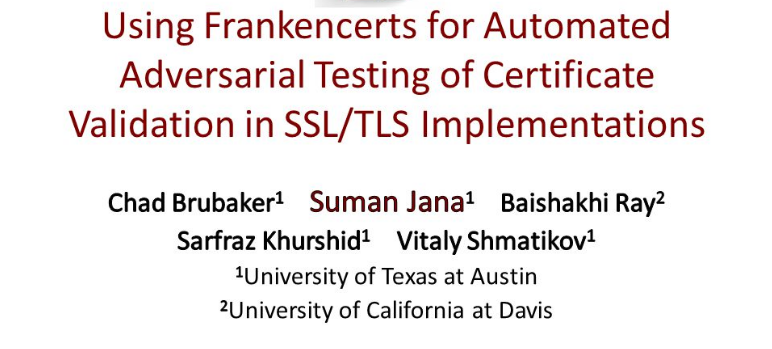

## Introduction
This is a review for the paper of "*Using Frankencerts for Automated Adversarial Testing of Certificate Validation in SSL/TLS Implementations*". The source is [here](https://www.cs.utexas.edu/~shmat/shmat_oak14.pdf) 

<!--more-->

## Summary
Nowadays, varieties of network devices are depended on SSL/TLS when they communicate with each other. Furthermore, certificates validation play a key role in SSL/TLS handshake protocol. So far, there is no good approach to check the certificate validation logic on a large scale. In this paper, the authors designed and implemented an automated testing tool named "frankencerts", Frankencerts acts as an intermediate certificate and it is generated from the real certificates. Several popular SSL/TLS libraries and web browsers are used for checking the frankencerts in discovering security flaws. The results show that adversarial testing with the frankencerts is a power methodology.

## Paper strengths 
The paper is well written and presents the concept and principle of SSL/STL. The most significant contribution is that they proposed an automated approach for validating certificate logic in SSL/TLS implementations. They tested over 8,127,600 frankencerts, which nearly cover all the possible combinations and give a well classified and analyzed result.

## Paper weaknesses
When it comes to weaknesses, it mainly reflects on the bellow parts: Firstly, the authors come up with a methodology for certificate validation in security flaws finding in SSL/TLS implementations. However, validation is only one part of the SSL/TLS handshake. Bugs may spring up in other progress of the handshake. Even the test results show one specific certificate implementation is secure, which can't guarantee it work well in reality. Then, in section VIII, they tested 8,127,600 frankencerts on their self-implemented clients, but the browsers are not included. (at least they didn't mention) which is not specific and accurate. Moreover, it cost about 1 second each execution of browser script, which is too inefficient for the browser testing.

## Detailed technical comments
P7. I have no idea about the tools of “ZMap”, they just used it directly without explaining anything.  
P8. I don’t know the difference between the section "Generating frankencerts" and "Generating synthetic mutations", It looks like they are the same meaning with the different expression.    
P9. Why they use 3 different frankencert-generating machines? What is the standard for selecting machines?    
P9. "we used the documentation provided by the libraries and followed the sample code in the documentation as closely as possible", So what is the code and documentation they mentioned?  
P10. As they said, it cost approximately 1 second for each execution of a script in the browser and they tested 8,127,600 frankencerts on the client, but they never mentioned they tested on the browser, what is the meaning of listing the verify running time in the browser.  
P15. I can’t understand the meaning of higher-level software and lower-level software in the section of "conclusions".  

