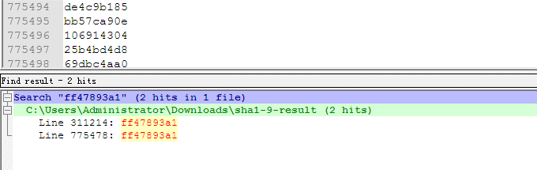

## 引言

> 区块链是一种去中心化的分布式账本系统，由于点对点网络下存在较高的网络延迟，各个节点所观察到的交易事务先后顺序不可能完全一致。 因此区块链系统需要设计一种机制对在一定的时间内发生的事务的先后顺序进行共识。这种对一个时间窗口内的事务的先后顺序达成共识的算法被称为“共识机制”。【1】

本文旨在阐述常见的区块链中的确认机制，主要结构如下，共识机制在比特币中的整体地位，常见的共识机制如POW，POS 和 DPOS，以及这几种机制之前的演进，关系与不同。
<!--more-->

## 共识机制

区块链系统的核心是有系统中节点竞争记账，这个竞争的过程称为共识机制，区块链的底层有四部分构成，一个分布式的数据库用来存储以往和将来的交易数据，密码学的公私密钥体系用来确认交易双方的身份，P2P网络用来广播和蔓延各类消息（如节点加入消息，节点失效消息，得到挖矿数据的消息）和 用来决定节点记账权利的共识机制。


共识机制在区块链中扮演着核心的地位，**共识机制决定了谁有记账的权利**，以及记账权利的选择过程和理由。不用的虚拟货币采用共识机制不同，常见的共识机制如POW，POS，DPOS 拜占庭容错等。现梳理如下：

Virtual Currency | Mechanism 
----|------
Bitcoin | POW 
Ppcoin  | POS 
ShadowCash | POS 
BlackCoin  | POS 
NuShares/NuBits.  | POS 
Ethereum. NXT | POW+POS  
AntShares | dBFT 

### POW
POW(Proof of Work)，即工作量证明机制。整个系统中每个节点为整个系统提供计算能力(简称算力)，通过一个竞争机制，让计算工作完成最出色的节点获得系统的奖励，也就是完成新生成货币的分配。【1】

区块链是一个持续增长的顺序块组成的，每个块包含了头文件和一系列的交易信息$TXi$，其中头文件中保护了timestamp $Ti$,上一个块的索引$Hi-1$,  和nounce $ Ni-1$ ,区块链是密码上的安全，对于每一轮只要找到相应的HASG的碰撞就算成功，HASG的碰撞的意思可以了解为hash值的前多少位相同，我们知道何难找到两个hash一模一样的文件，但是我们可以找到前几位相同的，我们将一个完整的挖矿过程整理如下：

$$f(Di) > SHA256(SHA256(Hi−1||Ti||TXi||di||Ni)))$$

其中$Di$是难度系数，可以认为是前多少位的碰撞。挖矿的过程就是在不停的尝试找$Ni$的过程。下面我们给出一个模拟挖矿的例子。
  
测试环境说明：

操作系统 | RAM | SWAP
----|------|----
Centos 6 x86 | 512M  | 256 MB

操作步骤：

1. 运行如下脚本
  
```
#!/ bin/bash  
n=1  
while [ $n -lt 1000000 ]  
do  
echo -n $n j sha1sum - j cut -c 1-9 >> sha1-9-result  
n=$ (( n+1 )) # increments $n  
done
sort sha1-9-result > sha1-9-result -sort
uniq -d sha1-9-result -sort > sha1-9-result -uniq
```

2. 对结果进行排序，找到前9位对撞成功的n的值.



实验结果如下：  

"311214" sha1 value is:    
ff47893a16ec612176cbb4255c7e0ce58400a828  
"775478" sha1 value is:    
ff47893a1f31dd5fd4220a9e8981112a2b3be2d6
  
虽然只是模拟实验，但是完整的反映了POW的运作原理。

### POS

POS， (Proof of Stake) 最初有Sunny King 在2102年在论文[PPCoin: Peer-to-Peer Crypto-Currency with Proof-of-Stake](https://www.mendeley.com/research-papers/ppcoin-peertopeer-cryptocurrency-proofofstake/) 中提出，这种机制通过计算你持有币数占总币数的百分比，包括你占有币数的时间来决定你获得本次记账权利的概率。

在 PoW 机制中，由于想要找到符合条件的 nonce. nonce 往往需要花费大量的电力和时间成本，因此，为了使每个 Block 更快被生成，PoS 机制去掉了穷举 noncenonce 这一过程，继而采用以下更快速的算法：【2】
$$SHA256(SHA256(B prev),A,t) ≤ balance(A)m$$

H 某个哈希函数  
t 为 UTC 时间戳  
Bprev 指的是上一个区块  
balance(A) 代表账户A 的账户的余额   
唯一可以不断调整的参数是 t，等式右边 m 是某个固定的实数，因此，当balance(A)越大，找到合理 t 的概率越大。网络中，普遍对于 t 的范围有所限制，如可以尝试的时间戳不能超过标准时间戳 1 小时，也就说，一个节点可以尝试 7200 次，来找到一个符合条件的t，如果找不到即可放弃。因此，在 PoS 中，**一个账户的余额越多，在同等算力下，就越容易发现下一个区块**.

### DPOW
Delegated Proof of Stake（委托股权证明） 是 PoS 的进化方案，在常规 PoW 和 PoS 中，一大影响效率之处在于任何一个新加入的 Block，都需要被整个网络所有节点做确认。DPoS 优化方案在于：通过不同的策略，不定时的选中一小群节点，这一小群节点做新区块的创建，验证，签名和相互监督，这样就大幅度的减少了区块创建和确认所需要消耗的时间和算力成本。【2】

## 机制的演进

在本章中我们会重点探讨POW->POS-DPOS这个演进的过程，哪些原因促使了区块链从POW到POS的转移。

比特币的设计之初，系统默认节点和算力是均匀分布的，因为通过CPU来进行投票，拥有钱包(节点)数和算力值应该是大致匹配的，每一个比特币钱包的拥有者都能够参与整个系统的决策机制，如果有任何人试图对系统作恶，或者某一部分节点收到损失，都可以让其他节点迅速补上，并且只要有51%的节点(算力)投票就可以选择对系统发展更有利的方向。

在实际操作中POW的主要问题是算力过于集中的安全风险，这种风险体现在比特币的控制权上，挖矿的人和持有比特币的人已经完全被隔开，许多矿工可能完全不了解比特币的生态，甚至不关心比特币的未来，却拥有对比特币的绝对控制权，因为他们是新币产生的起始点。一种极端的想法，如果几个大型的矿池联合在一起，那么最新发行的币将囤积，会造成原有币种的进一步通货紧缩。简而言之，比特币的命运掌握在并不一定关心比特币命运的人手上，而持有比特币的人并没有控制权。【3】

这就有点像，一个公司的命运并不是那些持有公司股份的股东来决定的，而是那些有可能根本不拥有股份，而只要有钱的人来决定的。那些持有比特币的人完全无法对比特币的未来做出自己的决定。我们仿佛从中本聪设定的一CPU一票的文明世界，一下子沦为纯粹是靠蛮力，看谁力气更大的原始社会。
  
DPOS机制似乎又重新把权利归还到那些持有数字货币的人手上。DPOS机制是让每一个持有BTS的人对整个系统资源当代表的人进行投票，而获得最多票数的101个代表进行交易打包计算。这个可以理解为101个矿池，而这101个矿池彼此的权利是完全相等的。那些握着BTS选票的人可以随时通过投票更换这些代表(矿池)，只要他们提供的算力不稳定，计算机宕机、或者试图利用手中的权力作恶，他们将会立刻被愤怒的选民门踢出整个系统，而后备代表可以随时顶上去。【3】
 
## 发行机制

POW的新增机制是“挖矿”，即矿工每完成一定量的计算，有可能获得一块新block中的新增比特币。这个过程是一个纯粹的通胀过程，即无中生有新增比特币。但获得新增的比特币有一定的要求，必须全球第一个找出特定的HASH值。因此发行机制是算力比例分配的。

POS的新增机制是“利息”，即持有一定的POS币一定时间，当然得开着客户端，将获得一定量的固定“利息”。这部分“利息”是新增的POS币。只要你持有POS币并开机，你就能获得一定比例的“利息”。 因此POS体系将新增POS币投放社会的机制，其投向是以已有POS币等比例增加的。

## 优缺点对比

类型 | 优点 | 缺点
----|------|----
PoW | 1.算法简单，容易实现；2.节点间无需交换额外的信息即可达成共识；3.破坏系统需要投入极大的成本；  | 　1.浪费能源；2.区块的确认时间难以缩短；3.新的区块链必须找到一种不同的散列算法，否则就会面临比特币的算力攻击；4.容易产生分叉，需要等待多个确认；5.永远没有最终性，需要检查点机制来弥补最终性；
POS/DPOS | 1.算法简单，能耗低  | 　1)没有专业化，拥有权益的参与者未必希望参与记账；2.容易产生分叉，需要等待多个确认；4.永远没有最终性，需要检查点机制来弥补最终性；【1】

## 总结
本文介绍了常见的共识机制，并阐述了其中的演进和发展的过程，下部分中我们将从确认时间，能耗，激励措施，经济模型等方面进行详细的分析。
## 声明
本文65%为翻译组合,**35%为原创**
d3d3LmVoY29vLmNvbSwg5L2c6ICFOmVoY29v（BASE64编码）
## 引用
1. https://baike.baidu.com/item/%E5%85%B1%E8%AF%86%E6%9C%BA%E5%88%B6/20234683?fr=aladdin
2. https://daimajia.com/2017/09/14/pow-and-pos
3. http://www.wanbizu.com/jingyan/201408231853.html
4. https://www.linkedin.com/pulse/%E6%B7%B1%E5%BA%A6%E6%8E%A2%E8%AE%A8pos%E6%9C%BA%E5%88%B6-%E9%B2%B2-%E7%8E%8B?trk=pulse-det-nav_art


