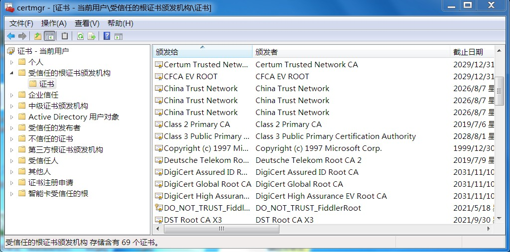
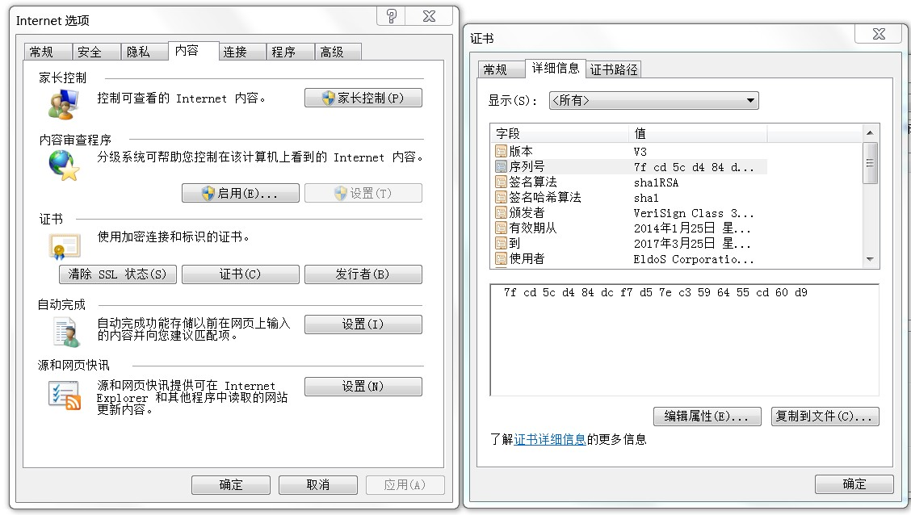

## 引言
我们大多数人每天都使用加密通信，你可能不知道，甚至从每关心它。如你用百度搜索东西，你在阿里巴巴上买了一件喜欢的衬衫，HTTPS能防止你的数据在网络传输过程中不被其他人窃取。

在本博客中，我们将介绍我们加密通信背后的知识，主要内容包括：为什么我们需要升级HTTP到HTTPS，HTTP的问题在哪里？TSL和SSL探讨，HTTPS是什么？HTTPS是如何工作的？从黑客的角度如何攻击HTTPS等。

在阅读本文之前，作者默认了你已经对称加密，非对称加密，摘要算法已经有所了解，如果实在没有基础也没关系，可以先读读这两篇预热下[《【密码学】一万字带您走进密码学的世界（上）》](http://www.ehcoo.com/cryptology.html),[《【密码学】一万字带您走进密码学的世界（下）》](http://www.ehcoo.com/cryptology1.html)

<!--more-->

## HTTP的问题在哪里？
如果你访问一个网站默认了超文本传输协议（HTTP），一种加密的互联网协议，其内容将显示在明文。这意味着每个人在你和服务器之间的位置都可以看到你与网站的每个交互内容。当用HTTP传输私人信息（姓名，电子邮件，家庭住址，信用卡详细信息等），黑客可以轻易的从网络流量中截取你发送信息，因为这些都是明文传输，下图使用fiddle2模拟的截取信息。

这种攻击方式就叫中间人攻击，当然因为这个衍生出来的还有缓存投毒，DDOS定向流向转发等，这些不是本文重点，这个中间人存在你的客户端和服务端的每个部分，例如，如果您连接到Wi-Fi热点，则您和服务器之间通过HTTP传输的所有内容将对热点中的每个参与者都可见。（是不是非常可怕，这也是不要轻易连接免费Wi-Fi的原因！！！）  

  

用专业的术语总结一下HTTP的问题：  
（1） 窃听风险（eavesdropping）：第三方可以获知通信内容。  
（2） 篡改风险（tampering）：第三方可以修改通信内容。  
（3） 冒充风险（pretending）：第三方可以冒充他人身份参与通信。  
技术进步的一个源动力是解决问题，这个时候一种加密技术应运而生那就是SSL。
## SSL探讨
SSL，英文全称Secure Sockets Layer，为Netscape所研发，用以保障在Internet上数据传输的安全，利用数据加密(Encryption)的技术，可确保数据在网络上的传输过程中不会被截取及窃听。SSL协议位于TCP/IP协议与各种应用层协议之间，为数据通讯提供安全支持。下面我深入探讨下SSL
写到这里我必须毅然燃起了我对网景公司的情怀，其实网景公司不只发明了SSL，还发明了很多 Web 的基础设施——比如“CSS 样式表”和“JS 脚本”

### TSL和SSL的区别
我们来看看SSL的发明历史，你就明白区别啦

*  1994年，NetScape公司设计了SSL协议（Secure Sockets Layer）的1.0版，但是未发布。
*  1995年，NetScape公司发布SSL 2.0版，很快发现有严重漏洞。
*  1996年，SSL 3.0版问世，得到大规模应用。
*  1999年，互联网标准化组织ISOC接替NetScape公司，发布了SSL的升级版TLS 1.0版。
*  2006年和2008年，TLS进行了两次升级，分别为TLS 1.1版和TLS 1.2版。最新的变动是2011年TLS 1.2的修订版。

很明显TLS就是SSL的升级版，那么它都升级哪些东西

*  1 版本号：TLS记录格式与SSL记录格式相同，但版本号的值不同，TLS的版本1.0使用的版本号为SSLv3.1。
*  2 报文鉴别码：SSLv3.0和TLS的MAC算法及MAC计算的范围不同。TLS使用了RFC-2104定义的HMAC算法。SSLv3.0使用了相似的算法，两者差别在于SSLv3.0中，填充字节与密钥之间采用的是连接运算，而HMAC算法采用的是异或运算。但是两者的安全程度是相同的。
*  3 伪随机函数：TLS使用了称为PRF的伪随机函数来将密钥扩展成数据块，是更安全的方式。
*  4 报警代码：TLS支持几乎所有的SSLv3.0报警代码，而且TLS还补充定义了很多报警代码，如解密失败（decryption_failed）、记录溢出（record_overflow）、未知CA（unknown_ca）、拒绝访问（access_denied）等。
*  5 密文族和客户证书：SSLv3.0和TLS存在少量差别，即TLS不支持Fortezza密钥交换、加密算法和客户证书。
*  6 certificate_verify和finished消息：SSLv3.0和TLS在用certificate_verify和finished消息计算MD5和SHA-1散列码时，计算的输入有少许差别，但安全性相当。
*  7 加密计算：TLS与SSLv3.0在计算主密值（master secret）时采用的方式不同。
*  8 填充：用户数据加密之前需要增加的填充字节。在SSL中，填充后的数据长度要达到密文块长度的最小整数倍。而在TLS中，填充后的数据长度可以是密文块长度的任意整数倍（但填充的最大长度为255字节），这种方式可以防止基于对报文长度进行分析的攻击。

**总而言之一句话：TLS比SSL更加标准化，更加安全**
## HTTPS探讨
HTTPS 相当于是“HTTP over SSL”。举个简单的例子， SSL就像你家自来水管道外面的一个防护膜。

### HTTPS是如何工作的
**注意因为篇幅原因，此处所探讨的只是HTTPS单向鉴别的实现。**比方说，你要连接到taobao.com。您在浏览器中键入地址，按回车并在毫秒内转到请求的网站。看起来很简单，对吧？但是实际上后台经过的数次的转发，我们在这里只讨论HTTPS建立单向连接的那部分。

具体的步骤如下：
+ 1.你的浏览器请服务器发送建立连接消息，消息中包含加密算法，是使用的协议等。
+ 2.服务器对你的浏览器回应一个消息，消息中包含证书信息，然后你可以对证书的真伪进行验证。
+ 3.验证通过之后，如果一切都按预期（即服务器已经成功验证），浏览器开始发送交换（和同意）应该用于此会话的随机密钥。
+ 4.服务器接收到到随机秘钥，然后开始进行数据交换。最终网页的内容安全地传输并显示在您的浏览器中。

可能你对上面的步骤依然存在疑惑，下面我们一起去解开它。首先证书是啥？其次证书如何校验真伪，在步骤3中，客户端像服务端发送的信息如何加密的？
### 电子证书是什么
假设你要和张三做生意，然后这个时候你不信任张三怎么办，你敢不敢贸然把货款打给他，答案肯定是否定的，这个找个信得过的中间人，有中间人开一份文件，有中间人李四的名义担保张三的人品信誉没问题，这个时候开的这个文件就叫证书（digital certificate）。  
在上面的比喻中，你就是浏览器，张三就是服务器，中间人李四就是认证中心CA（Certificate Authority），上面说了CA必须是“信得过的，德高望重的”，并不是每家机构都够资格颁发证书的。国内目前有34家CA搜索，下面列举几个

+ 中国电信认证中心（CTCA）
+ 海关认证中心（SCCA）
+ 国家外贸部EDI中心建立的国富安CA安全认证中心
+ 广东电子商务认证中心（以后称广东CA）为首的“网证通”认证体系
+ SHECA（上海CA）为首的UCA协卡认证体系。

如果你是服务商，首先你要像认证中心申请，然后认证中心给你颁发（当然了是收费的，而且还有期限），一旦颁发成功，你的浏览器展示就是这样的  

一些没有经过证书的网站，或者需要自己预装证书的网站  

**如何查看自己电脑上的证书？**  
1.windows 系统按 Win + R 键打开运行命令窗口，直接输入 certmgr.msc，就可以看到了，如下图所示：

2.也可以从浏览器中查看：工具->Internet选项->内容->证书

**电子证书有哪些部分组成?**  

+  版本信息，用来与X.509的将来版本兼容；
+  证书序列号，每一个由CA发行的证书必须有一个惟一的序列号；
+  CA所使用的签名算法；
+  发行证书CA的名称；
+  证书的有效期限；
+  证书主题名称；
+  被证明的公钥信息，包括公钥算法、公钥的位字符串表示；
+  包含额外信息的特别扩展。

**补充说明**  
浏览器对服务器的认证取决于两点：1，浏览器对中间人CA的信任，2，服务器自身采用公私钥加密协议并对外公布公钥。

## 总结
本文主要阐述了HTTPS的工作原理，介绍了证书的相关概念，在后续的文章中，我会以实际的项目环境配置（如nginx如何配置HTTPS,Tomcat如何配置HTTPS等）来进行分析。
## 声明
本文35%为翻译组合,**65%为原创**
## 引用
https://www.emerchantpay.com/blog/articles/what-is-https-and-why-should-i-use-encryption  
http://www.baike.com/wiki/SSL  
http://www.ruanyifeng.com/blog/2014/02/ssl_tls.html  
http://blog.csdn.net/adrian169/article/details/9164385  

