## Introduction
This is a representation in the Security Research Seminar 2017 in our school. In fact, it is a review of the paper "*Zerocash: Decentralized Anonymous Payments from Bitcoin*". This paper was published in 2014 IEEE Symposium on Security and Privacy by Eli Ben-Sasson and Alessandro Chiesa, and the source is [here](http://zerocash-project.org/media/pdf/zerocash-oakland2014.pdf) . 

<!--more-->

## The slides

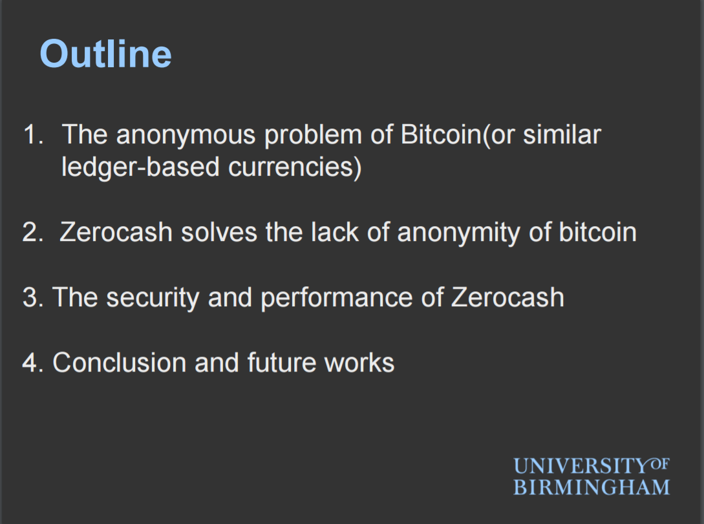
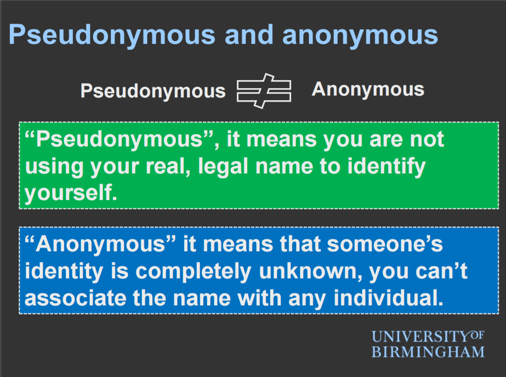

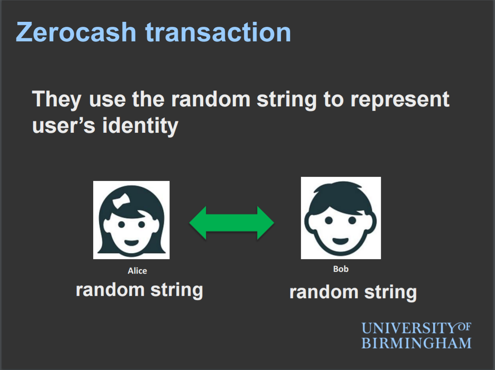

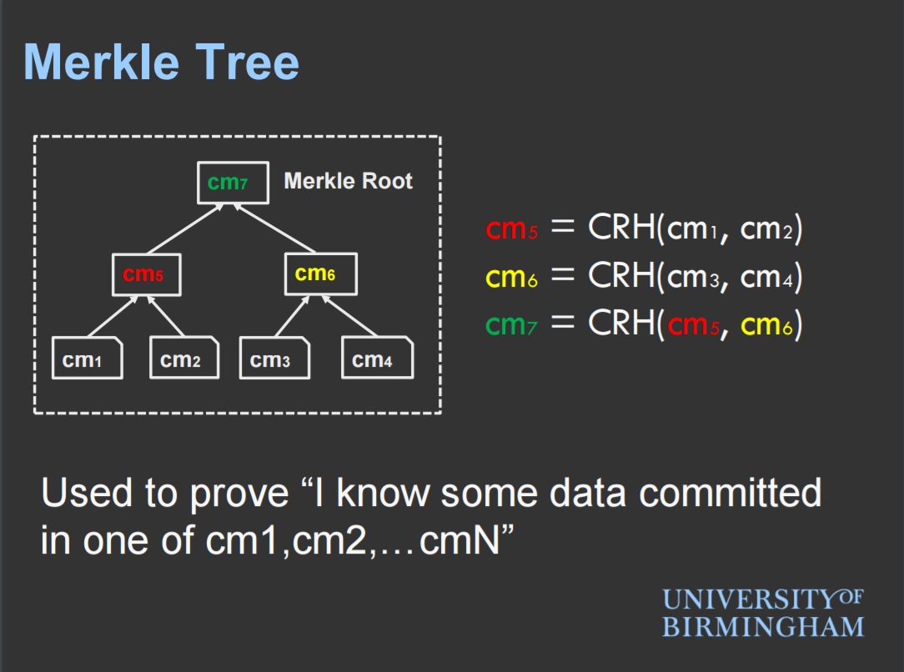

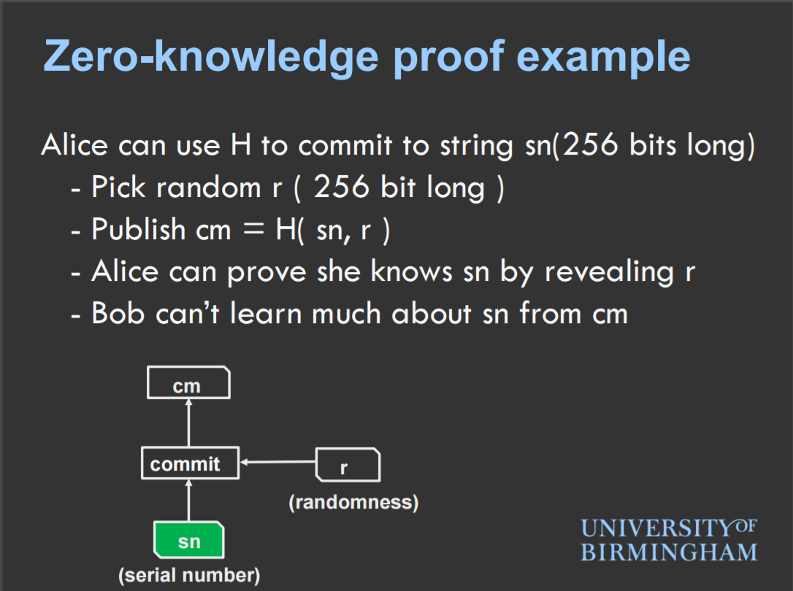

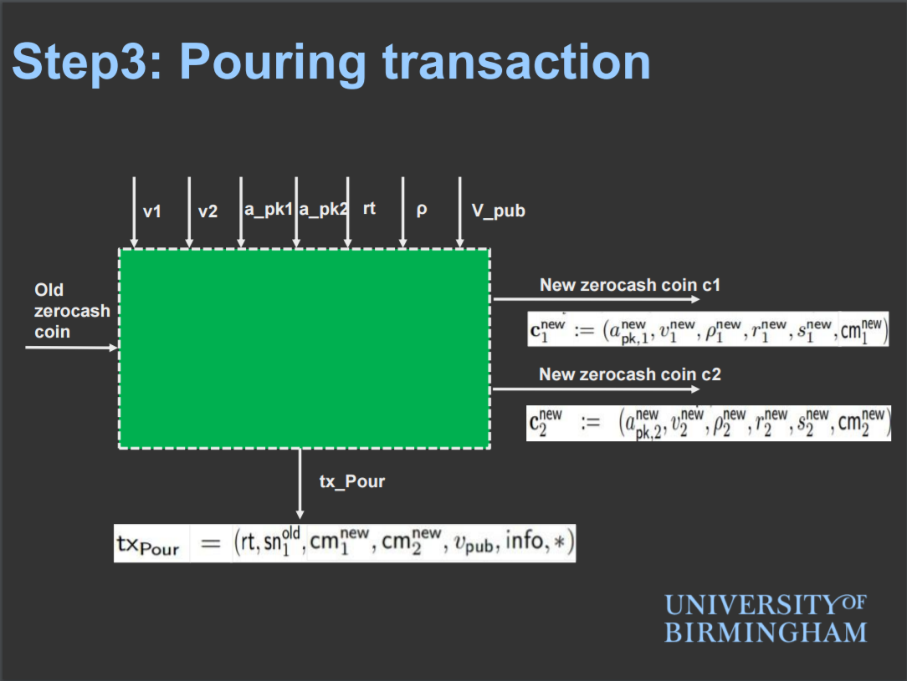

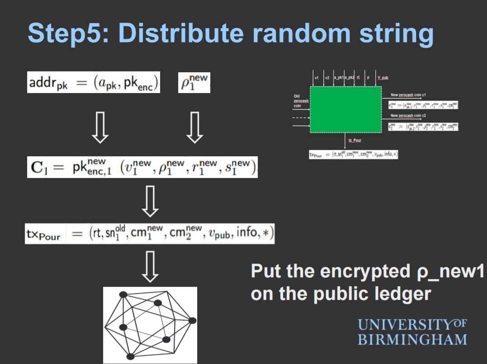

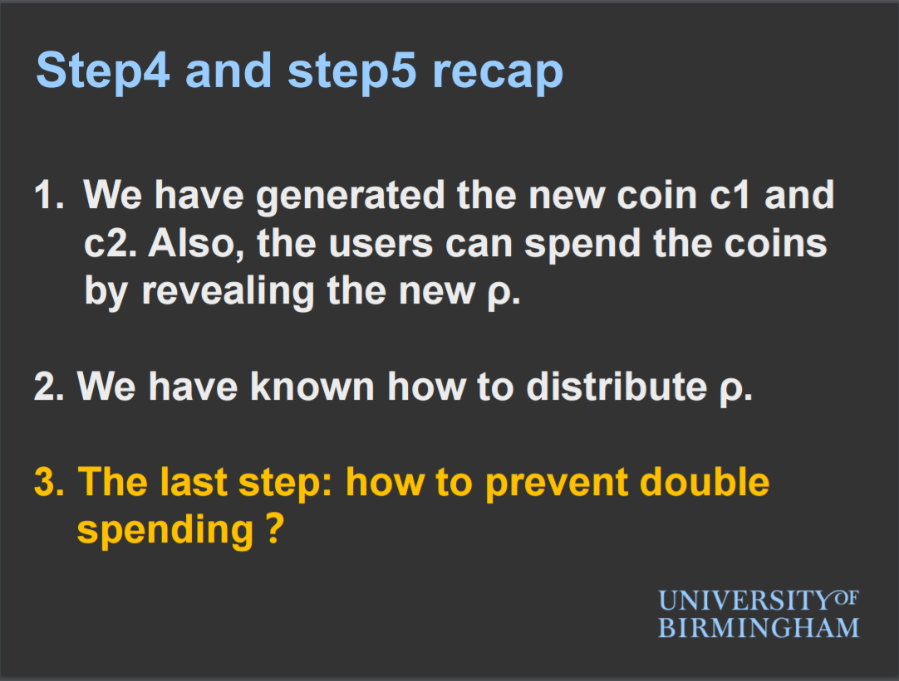
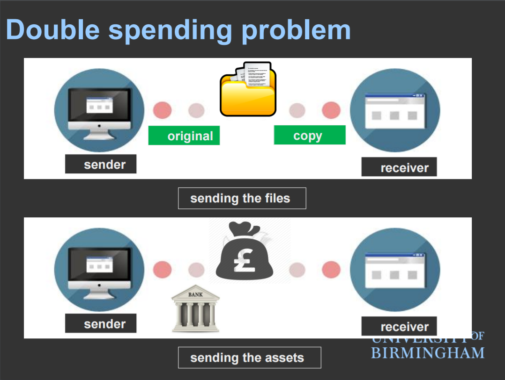

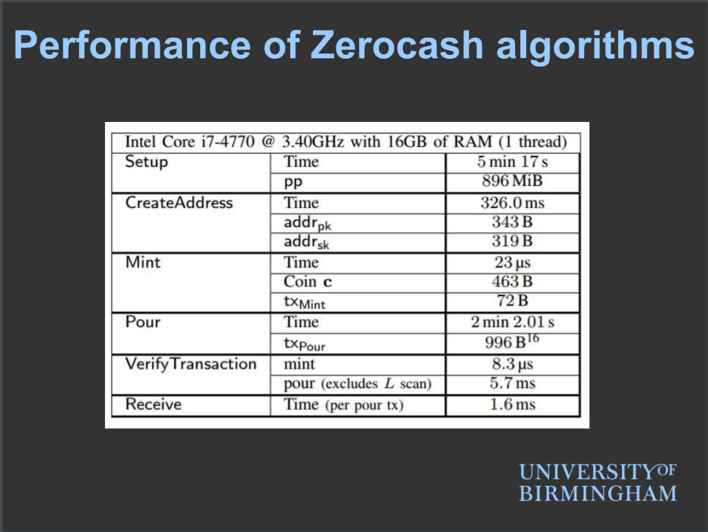
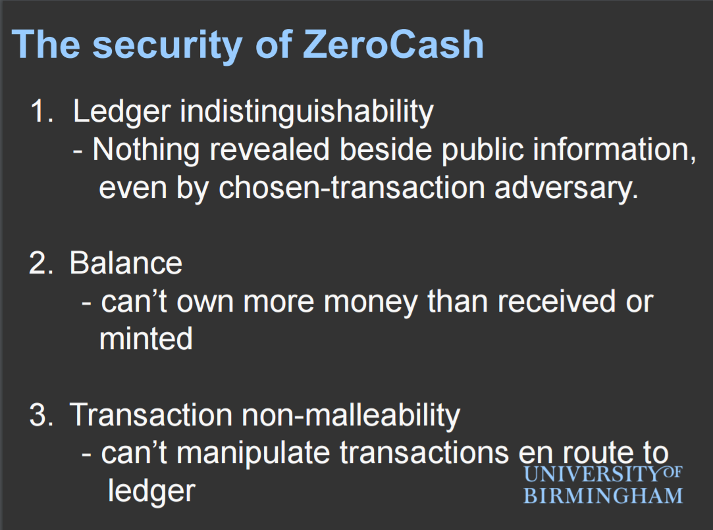
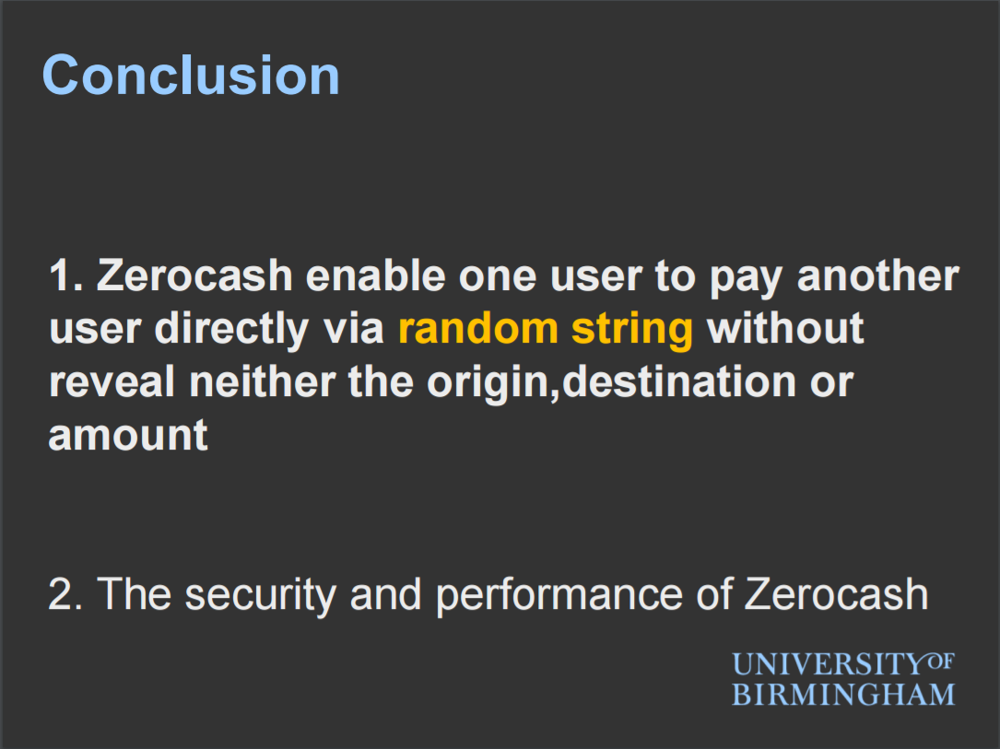

## Download
you can download the sides form [here](../images/2017/03/zerocash.pdf). 

